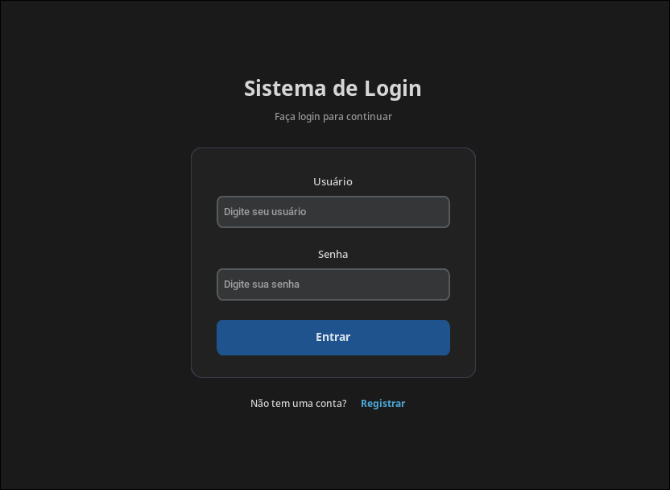
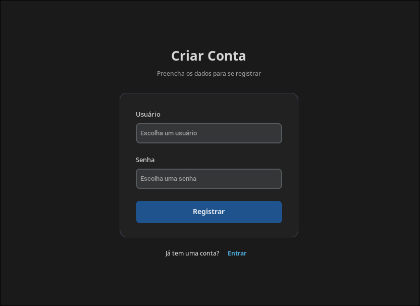
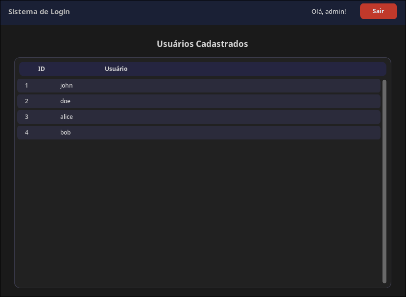

# Sistema de Login

Projeto desenvolvido em grupo para a disciplina de **Algoritmos e Programação**, ministrada pelo professor **Carlos**.

O sistema consiste em uma aplicação desktop construída em **Python**, utilizando a biblioteca **CustomTkinter** para criação de uma interface intuitiva.

A aplicação permite o gerenciamento básico de usuários, incluindo funcionalidades de **registro**, **autenticação** e diferenciação de permissões (usuário comum e administrador).

---

## Integrantes

- André Cândido
- Arthur Porcino
- Gusthavo
- Pablo
- Maciel Ferreira
- Kaily

---

## Instruções para execução

1. Certifique-se de ter o Python 3 instalado em seu sistema.
2. Instale a biblioteca CustomTkinter, utilizando o seguinte comando:

```bash
pip install customtkinter --break-system-packages
```

3. Clone este repositório: `git clone https://github.com/Arthuz2/sistema-login.git` e navegue até a pasta do projeto.
4. Execute o arquivo `main.py` para iniciar a aplicação:

```bash
python main.py
```

---

## Interface do sistema

### Tela de Login



---

### Tela de Registro



---

### Tela do Usuário


---

### Tela do Administrador


